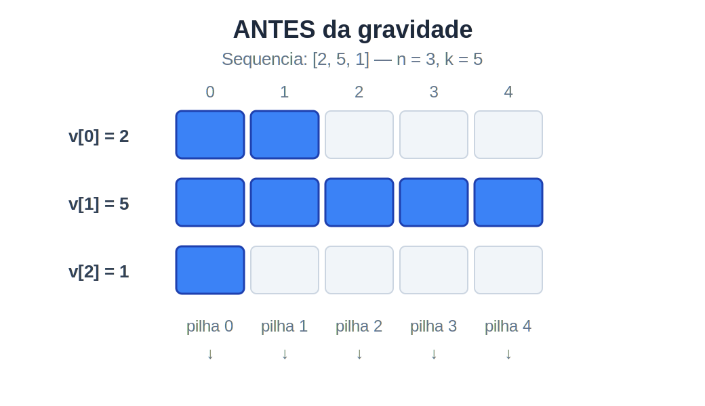
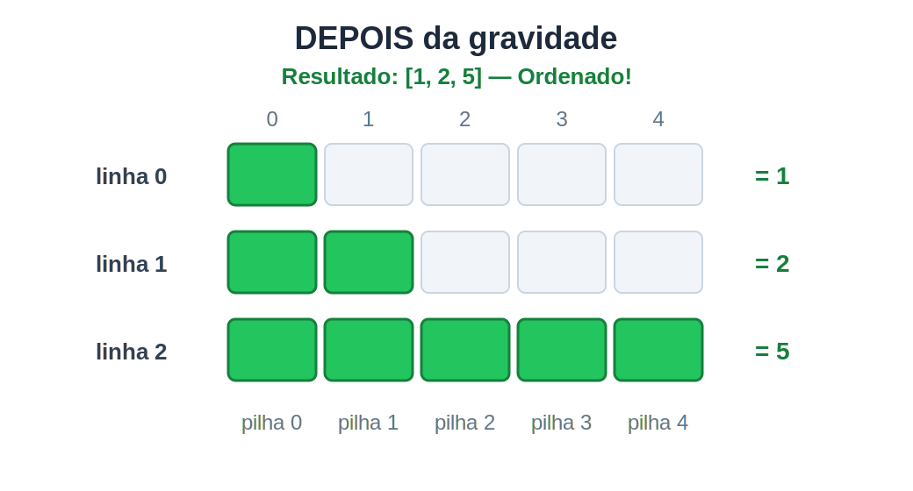

Gravity Sort
============

Considere o problema clássico de **ordenação**: dada uma sequência de $n$
inteiros positivos, queremos reorganizá-la em ordem crescente. Existem vários
algoritmos para isso, mas o que vamos estudar aqui resolve o problema de um
jeito bem diferente do usual: em vez de comparar pares de elementos, ele usa
a **gravidade**.


## A ideia

Imagine cada número da sequência como uma **linha de blocos**: o valor $2$
vira uma linha com $2$ blocos, o valor $5$ vira uma linha com $5$ blocos.
As linhas ficam empilhadas verticalmente, uma sobre a outra.

Por exemplo, para a sequência $[2, 5, 1]$:



Agora, imagine que os blocos estão sujeitos à gravidade e podem escorregar
para baixo, caindo de uma linha para a de baixo, até encontrar outro bloco
ou o fundo. Cada bloco cai **na vertical**, sem se mover para os lados.

??? Checkpoint

Imagine o que acontece quando os blocos caem por gravidade. Tente
desenhar (no papel ou mentalmente) como ficam as linhas depois que todos
os blocos terminam de cair.

::: Gabarito

Depois da queda, os blocos se acumulam embaixo em cada posição vertical:



:::

???

??? Checkpoint

Conte os blocos em cada linha no estado final, de cima para baixo.
Que sequência você obtém? O que isso tem a ver com a sequência original?

::: Gabarito

De cima para baixo, as linhas ficam com $1, 2, 5$ blocos. Essa é
exatamente a sequência $[2, 5, 1]$ **ordenada em ordem crescente**!

A gravidade fez com que linhas com mais blocos naturalmente afundassem
e linhas com menos blocos subissem. Ou seja, a gravidade ordenou a
sequência.

:::

???

Esse é o **Gravity Sort** (também chamado de *Bead Sort*). Ele ordena
inteiros positivos simulando a queda de blocos por gravidade.


## Representação como matriz

A ideia visual está clara, mas como representar isso no computador? Vamos
construir a representação juntos.

??? Checkpoint

Pense em como você codificaria a sequência $[2, 5, 1]$ em uma grade,
usando apenas dois símbolos: `●` (tem bloco) e `○` (vazio). Quantas
linhas e quantas colunas a grade precisa ter? Como ela ficaria?

**Dica:** cada número da sequência vira uma linha. O maior número da
sequência determina quantas colunas você precisa.

::: Gabarito

Para $[2, 5, 1]$, precisamos de $3$ linhas (uma por número da sequência)
e $5$ colunas (o suficiente para caber o maior valor). Em cada linha, os
`●` ficam encostados à esquerda:

|         | col 0 | col 1 | col 2 | col 3 | col 4 |
|---------|:-----:|:-----:|:-----:|:-----:|:-----:|
| linha 0 |   ●   |   ●   |   ○   |   ○   |   ○   |
| linha 1 |   ●   |   ●   |   ●   |   ●   |   ●   |
| linha 2 |   ●   |   ○   |   ○   |   ○   |   ○   |

A linha 0 tem dois `●` (valor $2$), a linha 1 tem cinco `●` (valor $5$),
e a linha 2 tem um `●` (valor $1$).

:::

???

Essa é a **representação como matriz**. Duas quantidades caracterizam o
tamanho dela:

- $n$ = quantidade de números na sequência → **número de linhas** da matriz.
- $k$ = maior valor da sequência → **número de colunas** da matriz.

Note como $n$ e $k$ são bem diferentes: para $[2, 5, 1]$, temos $n = 3$
(apenas três números) mas $k = 5$ (o maior deles).

??? Checkpoint

Considere a sequência $[2, 1, 2]$. Quais são os valores de $n$ e $k$?
Monte a matriz correspondente. Você observa algo curioso?

::: Gabarito

Temos $n = 3$ números e o maior valor é $k = 2$, então a matriz é
$3 \times 2$ (três linhas, duas colunas):

|         | col 0 | col 1 |
|---------|:-----:|:-----:|
| linha 0 |   ●   |   ●   |
| linha 1 |   ●   |   ○   |
| linha 2 |   ●   |   ●   |

O curioso: as linhas 0 e 2 são **idênticas**, porque ambas representam o
mesmo valor ($2$). Isso é esperado — a matriz não tem como distinguir dois
elementos que valem a mesma coisa. Vamos revisitar essa observação quando
discutirmos limitações.

:::

???


## Gravidade na matriz

Agora que temos a matriz, precisamos simular a queda dos blocos.

??? Checkpoint

Pegue a matriz da sequência $[2, 5, 1]$. Como você simularia a gravidade
nela? Aplique a regra que descobrir, depois conte os `●` em cada linha
do resultado de cima para baixo. O que você obtém?

**Dica:** os blocos só caem na vertical, então pense coluna por coluna.
Em cada coluna, para onde os `●` devem ir? Comece pela coluna 0: ela tem
três `●` em três posições, então nada muda. Agora olhe a coluna 1: ela
tem `●` nas linhas 0 e 1. Depois da queda, esses dois `●` devem ocupar
as linhas 1 e 2.

::: Gabarito

A regra: em cada **coluna**, empurrar todos os `●` para o fundo. Eles
caem até a base, formando um bloco contínuo de `●` nas últimas posições.

Antes e depois da gravidade:

| **ANTES** | c0 | c1 | c2 | c3 | c4 |   | **DEPOIS** | c0 | c1 | c2 | c3 | c4 |
|-----------|:--:|:--:|:--:|:--:|:--:|---|------------|:--:|:--:|:--:|:--:|:--:|
| linha 0   |  ● |  ● |  ○ |  ○ |  ○ |   | linha 0    |  ● |  ○ |  ○ |  ○ |  ○ |
| linha 1   |  ● |  ● |  ● |  ● |  ● |   | linha 1    |  ● |  ● |  ○ |  ○ |  ○ |
| linha 2   |  ● |  ○ |  ○ |  ○ |  ○ |   | linha 2    |  ● |  ● |  ● |  ● |  ● |

Contando os `●` em cada linha do resultado: $[1, 2, 5]$.

É a sequência original ordenada!

:::

???


## Por que funciona?

Já vimos que a gravidade ordena nos exemplos, mas por que isso sempre
funciona? Vamos entender passo a passo.

??? Checkpoint

Olhe novamente o antes e o depois da gravidade na sequência $[2, 5, 1]$.
Compare as colunas individualmente. O que permanece igual entre o antes e o
depois?

**Dica:** conte os blocos em cada coluna, antes e depois.

::: Gabarito

A quantidade de blocos em cada coluna é a mesma antes e depois:

- Coluna 0: 3 $\rightarrow$ 3
- Coluna 1: 2 $\rightarrow$ 2
- Coluna 2: 1 $\rightarrow$ 1
- Coluna 3: 1 $\rightarrow$ 1
- Coluna 4: 1 $\rightarrow$ 1

Isso faz sentido: a gravidade apenas rearranja os blocos dentro de cada
coluna. Ela não cria nem destrói blocos. Então a quantidade por coluna se
mantém.

:::

???

??? Checkpoint

Voltando ao exemplo $[2, 5, 1]$, olhe a coluna 1 da matriz antes da
gravidade. Quais linhas têm um bloco nessa coluna? O que esses valores
originais têm em comum?

::: Gabarito

As linhas 0 e 1 têm um bloco na coluna 1. Os valores originais dessas
linhas são $2$ e $5$, que são exatamente os valores **maiores que $1$** na
sequência.

Isso vale em geral: a coluna $j$ tem um bloco em cada linha cujo valor
original é maior que $j$. Então a quantidade de blocos na coluna $j$ nos
diz **quantos elementos da entrada são maiores que $j$**.

:::

???

??? Checkpoint

Agora pense no que acontece depois da gravidade. Em cada coluna, os
blocos são empurrados para o fundo. Isso significa que as **últimas
linhas** recebem blocos de **mais colunas** do que as primeiras linhas.

Olhe a matriz depois da gravidade no exemplo $[2, 5, 1]$:

- A última linha (linha 2) recebeu blocos de todas as 5 colunas
  $\rightarrow$ valor $5$.
- A linha do meio (linha 1) recebeu blocos de 2 colunas $\rightarrow$
  valor $2$.
- A primeira linha (linha 0) recebeu um bloco de apenas 1 coluna
  $\rightarrow$ valor $1$.

Por que as linhas de baixo sempre acabam com mais blocos do que as de cima?

::: Gabarito

Em cada coluna, os blocos são empurrados para baixo. Então, se uma coluna
tem poucos blocos, eles só chegam às últimas linhas. Se tem muitos blocos,
eles alcançam linhas mais acima também.

Uma linha só recebe um bloco de uma coluna se essa coluna tem blocos
**suficientes** para chegar até ela. Como as linhas de baixo são as
primeiras a receber (a gravidade puxa para baixo), elas acumulam blocos
de **todas** as colunas, enquanto as linhas de cima só recebem blocos
das colunas que tinham muitos. Resultado: as linhas de baixo ficam com
mais blocos, ou seja, com valores maiores. E é por isso que a sequência
sai ordenada de cima para baixo.

:::

???


## Complexidade

??? Checkpoint

O Gravity Sort tem três etapas: preencher a matriz, aplicar a gravidade
coluna por coluna e ler o resultado. Qual é a complexidade de tempo do
algoritmo em função de $n$ (quantidade de números) e $k$ (maior valor)?

**Dica:** analise cada etapa separadamente. Quantas operações cada uma
faz em função de $n$ e $k$?

::: Gabarito

- Preencher a matriz: percorre $n$ linhas de $k$ colunas cada $\rightarrow$
  $O(n \cdot k)$.
- Aplicar a gravidade: para cada uma das $k$ colunas, percorre $n$ linhas
  para contar e reescrever $\rightarrow$ $O(n \cdot k)$.
- Ler o resultado: percorre $n$ linhas de $k$ colunas $\rightarrow$
  $O(n \cdot k)$.

Total: $O(n \cdot k)$.

:::

???

??? Checkpoint

Compare a complexidade $O(n \cdot k)$ do Gravity Sort com a complexidade
$O(n \log n)$ de algoritmos como merge sort. Em que situações o Gravity
Sort é melhor? E quando ele é pior?

::: Gabarito

- Se $k$ é pequeno (por exemplo, $k < \log n$), o Gravity Sort é mais
  rápido que merge sort.
- Se $k$ é muito grande (por exemplo, $k = 1\,000\,000$ para poucos
  elementos), o Gravity Sort é muito mais lento.

Além disso, o Gravity Sort consome $O(n \cdot k)$ de memória para a
matriz, enquanto merge sort usa $O(n)$.

:::

???


## Limitações

Vamos descobrir as limitações do Gravity Sort experimentando casos
extremos.

??? Checkpoint

Tente aplicar Gravity Sort na sequência $[1, 1\,000\,000]$. Quais são os
valores de $n$ e $k$? Qual o tamanho da matriz?

::: Gabarito

$n = 2$ e $k = 1\,000\,000$. A matriz tem $2 \times 1\,000\,000 = 2$
milhões de posições — para ordenar apenas dois números!

Isso revela uma limitação séria: o Gravity Sort consome $O(n \cdot k)$ de
memória, o que é proibitivo quando $k$ é grande, mesmo com poucos
elementos. Em comparação, merge sort usa $O(n)$ de memória.

:::

???

??? Checkpoint

Tente representar a sequência $[-3, 2, 5]$ na matriz. E a sequência
$[1{,}5;\ 2{,}5]$? O que dá errado?

::: Gabarito

Não há como representar valores negativos: "menos três blocos" não faz
sentido. Também não há como representar frações: "meio bloco" também
não.

O Gravity Sort só funciona com **inteiros positivos**. Algoritmos como
merge sort e quicksort não têm essa restrição: comparam quaisquer
elementos para os quais exista uma ordem.

:::

???

??? Checkpoint

Lembre da matriz da sequência $[2, 1, 2]$ que vimos antes: as linhas 0 e
2 ficaram **idênticas**. Depois de aplicar a gravidade e ler o resultado,
você consegue saber qual dos dois $2$s da entrada veio primeiro?

::: Gabarito

Não. As duas linhas são indistinguíveis na matriz, então depois da
gravidade não há como recuperar qual veio antes na entrada original.

Essa propriedade tem um nome: o Gravity Sort **não é estável**. Um
algoritmo de ordenação é estável quando elementos de mesmo valor
preservam a ordem relativa original. Isso importa em aplicações onde os
elementos carregam informação extra além do valor que estamos usando
para ordenar.

:::

???


## De matriz para vetor

A versão com matriz funciona, mas será que realmente precisamos dela toda?
Vamos investigar.

??? Checkpoint

Pense no que acontece quando aplicamos a gravidade em uma coluna. Depois
da gravidade, a coluna $j$ fica com $c_j$ blocos embaixo e o resto vazio
em cima. Para reconstruir o resultado final (contar os blocos em cada
linha), você realmente precisa saber **onde** cada bloco estava antes, ou
basta saber **quantos** blocos havia em cada coluna?

::: Gabarito

Basta saber a **quantidade** $c_j$ de blocos em cada coluna! Depois da
gravidade, a posição dos blocos é completamente determinada por $c_j$:
eles ocupam as últimas $c_j$ linhas. Os `●` e `○` individuais da matriz
são informação redundante.

Isso significa que podemos trocar a matriz inteira por um **vetor de
contagens** de tamanho $k$.

:::

???

??? Checkpoint

Lembre que $c_j$ é a quantidade de elementos da entrada estritamente
maiores que $j$. Pense em uma maneira de calcular todos os $c_j$ a partir
da sequência original, **sem montar a matriz**.

**Dica:** se um elemento da entrada tem valor $v$, para quais colunas ele
contribui um bloco?

::: Gabarito

Um elemento de valor $v$ contribui um bloco para as colunas $0, 1, 2,
\ldots, v-1$. Ou seja, ele incrementa $c_j$ para todo $j < v$.

Percorrendo a entrada uma vez e, para cada elemento, incrementando as
posições correspondentes no vetor de contagens, obtemos todos os $c_j$ sem
precisar da matriz.

:::

???

??? Checkpoint

O vetor $c$ funciona, mas guardar "quantos elementos são maiores que $j$"
é meio indireto. Existe uma forma mais natural: em vez disso, guardar
**quantas vezes cada valor aparece na entrada**. Isso é um **histograma** —
uma reorganização da mesma informação que estava em $c$, em uma forma mais
direta de calcular e de usar.

Se $h[j]$ é o número de vezes que o valor $j+1$ aparece na entrada, como
você reconstruiria a sequência ordenada a partir de $h$?

**Dica:** se $h[0] = 2$, o que isso significa para o resultado?

::: Gabarito

Se $h[0] = 2$, significa que o valor $1$ aparece duas vezes. Então
escrevemos duas cópias de $1$ no resultado. Se $h[1] = 0$, o valor $2$ não
aparece. Se $h[2] = 1$, escrevemos uma cópia de $3$, e assim por diante.

A sequência ordenada é simplesmente o histograma "expandido":

$$h[0] \text{ cópias de } 1, \quad h[1] \text{ cópias de } 2, \quad \ldots, \quad h[k-1] \text{ cópias de } k$$

:::

???

??? Checkpoint

Aplique essa ideia à sequência $[3, 1, 4, 1, 2]$.

1. Calcule o histograma $h$.
2. Expanda o histograma para obter a sequência ordenada.

::: Gabarito

Sequência: $[3, 1, 4, 1, 2]$. O maior valor é $k = 4$.

Histograma:

- $h[0] = 2$ (o valor $1$ aparece duas vezes)
- $h[1] = 1$ (o valor $2$ aparece uma vez)
- $h[2] = 1$ (o valor $3$ aparece uma vez)
- $h[3] = 1$ (o valor $4$ aparece uma vez)

Expandindo: $1, 1, 2, 3, 4$. A sequência ordenada!
 
:::

???

??? Checkpoint

Compare essa versão com vetor com a versão com matriz. Quais são as
vantagens?

::: Gabarito

- **Memória:** usa um vetor de tamanho $k$ em vez de uma matriz
  $n \times k$. Para $n = 1\,000$ e $k = 100$, são $100$ posições em vez
  de $100\,000$.
- **Simplicidade:** o código fica mais curto e direto.
- **Tempo melhor:** $O(n + k)$ em vez de $O(n \cdot k)$. Não precisamos
  mais varrer todas as $k$ colunas para cada elemento.

:::

???

Se essa versão com vetor parece familiar, é porque ela é! Esse algoritmo é
exatamente o clássico **Counting Sort**. O Gravity Sort com matriz é, no
fundo, uma versão visualmente intuitiva do Counting Sort. A matriz que tanto
construímos era apenas uma representação redundante de um histograma bem mais
simples.


## Implementação (desafio)

Agora que a ideia está clara, o desafio é traduzir o algoritmo para código.
Abaixo está um esqueleto da versão com histograma (Counting Sort).

??? Desafio

Complete a implementação abaixo:

```c
void gravity_sort(int *v, int n) {
    // 1) encontre o maior valor k
    int k = v[0];
    for (int i = 1; i < n; i++) {
        // ?
    }

    // 2) crie o histograma
    int *h = malloc(k * sizeof(int));
    for (int j = 0; j < k; j++) {
        h[j] = 0;
    }
    for (int i = 0; i < n; i++) {
        // ?
    }

    // 3) expanda o histograma de volta para v
    int idx = 0;
    for (int j = 0; j < k; j++) {
        for (int t = 0; t < h[j]; t++) {
            // ?
        }
    }

    free(h);
}
```

::: Gabarito

```c
void gravity_sort(int *v, int n) {
    // 1) encontre o maior valor k
    int k = v[0];
    for (int i = 1; i < n; i++) {
        if (v[i] > k) {
            k = v[i];
        }
    }

    // 2) crie o histograma
    int *h = malloc(k * sizeof(int));
    for (int j = 0; j < k; j++) {
        h[j] = 0;
    }
    for (int i = 0; i < n; i++) {
        h[v[i] - 1]++;
    }

    // 3) expanda o histograma de volta para v
    int idx = 0;
    for (int j = 0; j < k; j++) {
        for (int t = 0; t < h[j]; t++) {
            v[idx] = j + 1;
            idx++;
        }
    }

    free(h);
}
```

:::

???